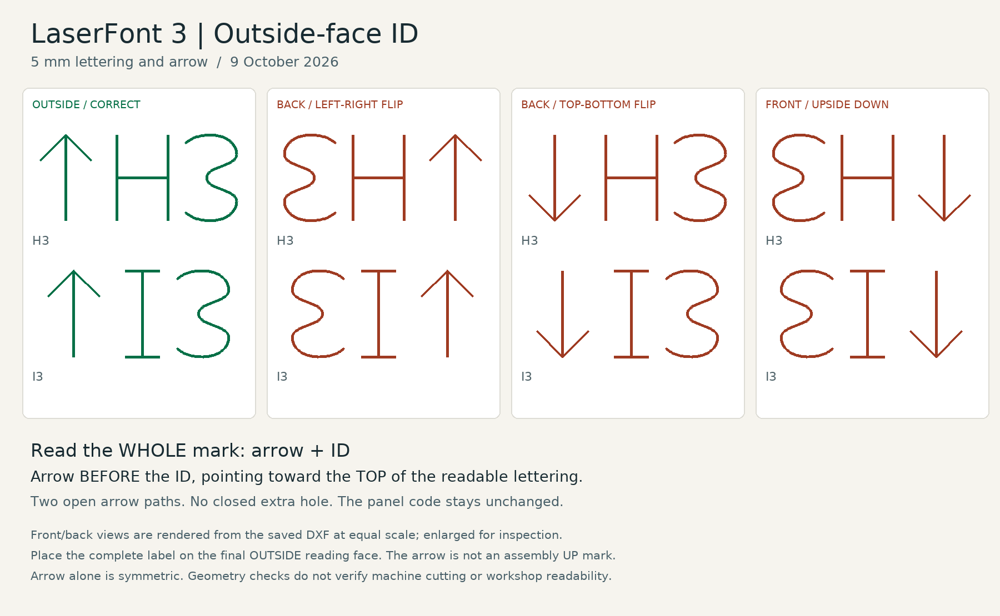
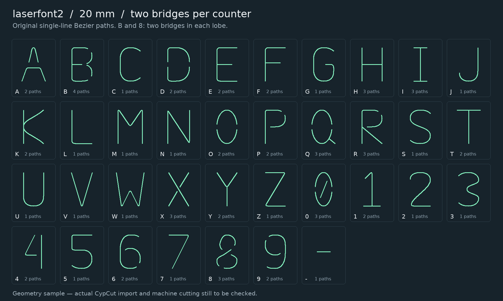

# LaserFont 3 — Single-Line Stencil IDs with an Outside-Face Key

LaserFont is an original single-line stencil font for small part IDs cut directly into sheet metal. Version 3 adds a mandatory asymmetric corner key to every ID. The key exposes a reversed viewing face even when the letters themselves, such as `H3` or `I3`, look unchanged after a flip. The existing character shapes, two bridges per enclosed counter and cubic Bézier masters are retained.

Designed by **Artkis**. The font is open source under the **SIL Open Font License 1.1**; the supporting utility code uses the **MIT License**. See [Licensing](LICENSING.md).

## Version 3.0.2 — 9 October 2026



Read the complete **key + ID** from the final assembly's outside face: **long arm LEFT, base BELOW, short arm RIGHT**. This rule applies to both top and bottom sheets. The key is an orientation symbol, not another letter in the part code.

At the default **5 mm cap height**, the key is 5 mm high and 3 mm wide, with a 1.5 mm gap before the code. It adds one continuous open path and 4.5 mm of label width. It creates no closed extra hole. The key and characters are grouped together in the DXF. Keep the complete group together when positioning or nesting.

The revised exporter always includes the key; it cannot be disabled. The unchanged version 2 exporter remains available for historical reproduction, but it does **not** provide this orientation cue.

### Generate a version 3 ID

```console
python -m pip install -r requirements.txt
python generate_laserfont3.py --text H3 --height 5 --output H3-keyed.dxf
python generate_laserfont3.py --text I3 --height 5 --mode polyline --output I3-keyed.dxf
```

`--x` and `--y` locate the key's left baseline. Rotation applies to the whole label. Exact mode retains the Bézier character paths; polyline mode uses the existing fitted arc characters. In both modes the new key is one open, zero-width polyline.

### Install for AutoCAD 2023

The release includes a compiled [laserfont3.shx](cad/laserfont3.shx) display font, [LASER3.lsp](cad/LASER3.lsp) and a [Windows installer](cad/Install-LaserFont3.ps1). Extract the complete release, then run these commands in PowerShell from its root folder:

```powershell
.\cad\Install-LaserFont3.ps1 -WhatIf
.\cad\Install-LaserFont3.ps1
```

The installer copies the font and command files to the current user's AutoCAD 2023 Support folder and updates the LASEROUT application bundle. It backs up replaced files under `%LOCALAPPDATA%\LaserFont\backups`, retains the bundle's existing ProductCode and verifies the installed file hashes. Existing `laserfont.shx` and `laserfont2.shx` files are preserved. It does not change drawings, registry security settings or the Startup Suite.

Restart AutoCAD to use the updated bundle. To refresh commands in an already open drawing, use `APPLOAD` on the installed `LASEROUT.lsp` in the AutoCAD Support folder. The installer does not load commands into a running drawing.

### Type the ID, then run LASEROUT

1. Run `LASERFONT` once to select the LaserFont3 text style and set the default text height to **5**.
2. Use ordinary AutoCAD `TEXT` or plain one-line `MTEXT`. Type the ID normally, for example `H3` or `I3`.
3. Run **`LASEROUT`** and select the text. It creates the open arc/line cutting polylines and exactly one orientation key, grouped with the ID.

`LASEROUT` is the only conversion command. `LASERFONT` is a setup command; no numbered conversion or insertion commands are needed.

Heights are **drawing units**: 5 means 5 mm in a millimetre drawing. The setup default does not resize existing text. Conversion preserves the selected text's height, so an existing **2.5 mm** label stays **2.5 mm**.

Bare IDs are accepted. If LaserFont3 text already has one leading `~`, such as `~H3`, it is also accepted and becomes exactly one key. The display font draws `~` as the corner key; it is not part of the ID. Doubled or embedded prefixes are rejected.

`LASEROUT` accepts eligible text using `laserfont.shx`, `laserfont2.shx` or `laserfont3.shx`. Bare text retains its character baseline; the key extends 4.5 mm to its left at height 5, or 2.25 mm at height 2.5. Prefixed LaserFont3 text retains its existing key baseline. See [the AutoCAD notes](cad/README-v3.md) for supported text properties and restrictions.

SHX is a display approximation. Use `LASEROUT` to create cutting geometry; do not use `TXTEXP`.

### Samples and checks

- [Complete keyed character set](examples/laserfont3-alphabet.png)
- [5 mm exact DXF samples](examples/laserfont3-H5-samples-bezier.dxf)
- [5 mm arc/polyline DXF samples](examples/laserfont3-H5-samples-polyline.dxf)
- [A4 specimen at actual size](examples/laserfont3-H5-print.pdf) — print at 100% and check the 50 mm scale line.

```console
python -m pip install -r requirements-validation.txt
python -m unittest discover -s tests -v
python render_orientation.py
```

The Python regression tests reproduce the old `H3`/`I3` ambiguity, check mirrored and rotated keyed labels, preserve the original glyph controls and verify saved DXF groups, dimensions and open paths.

Native AutoCAD checks record text conversion, the compiled display font, grouping, cancellation, Undo and saved-drawing reopening in [the native test report](cad/native-test-report-v3.json). The report's version and source hashes identify the build tested; results from an earlier version do not verify a later command change.

One `U` reverses a converted batch and restores its original text. The native test harness disables automatic script-level Undo grouping to check this boundary; the delivered routine does not change the user's Undo settings. The earlier partial Undo result came from the script's grouping, not a demonstrated failure of the routine's Begin/End logic.

These results cover the recorded geometry and isolated native commands. GUI installation, foreground interactive use, physical Escape-key input, new MTEXT/UCS cases, CAM import and physical cutting were not tested by that suite. The checks do not establish how reliably a person will recognize the mark on a cut part.

The complete label must fit within the actual part, clear of outlines, holes and bends. The font cannot choose the final assembly's exterior face: that face must be traced from the formed model to the flat before placing the ID. A correctly readable label on the wrong face is still wrong. Verify the actual CAM import and a physical 5 mm sample before treating workshop readability and cutting quality as proven.

## Version 2 reference: historical 20-unit defaults

The preserved version 2 source files are archival. Their 20-unit defaults do not apply to the current AutoCAD workflow above. The measured path counts exclude the version 3 key. Use the installed current loader for active work; loading an archived LISP file can restore obsolete command definitions.



### What version 2 provides

- Uppercase **A-Z**, **0-9**, hyphen and space. Lowercase input maps to uppercase shapes.
- **20 mm actual cap height** in the master geometry. The tools scale uniformly to other heights.
- **One cutting centerline**, without filled letter outlines or parallel outline contours.
- **Two uncut bridge gaps per counter**. `B` and `8` each have two counters, so they have four gaps in total.
- Nominal **3 mm centerline gaps at 20 mm height**; some glyphs use wider gaps. Gaps scale with the lettering.
- Exact cubic Bézier master geometry, plus an alternative made of real circular arcs and lines for software that handles polylines more reliably.
- An AutoCAD SHX display font and AutoLISP tools that generate permanent geometry without requiring a font on the receiving machine.

The drawing is intended for **single-line through-cutting**, rather than filled text, engraving, or marking. Other CNC uses require a suitable on-path operation and a tool that can reproduce the details.

### Why fewer paths and smoother curves?

A separate cut path can require another stop, repositioning move and pierce. LaserFont prioritizes fewer disconnected paths while preserving the bridges and readable character shapes. Rounded transitions also avoid many abrupt changes in direction.

Friendess identifies excessive nodes and micro-segments as one possible cause of slow or paused processing in CypCut, and discusses Bézier transitions when addressing sharp-corner behavior. This supports the design direction; it does not establish a cycle-time improvement for this font. See the [FSCUT2000C manual, sections 6.3 and 6.4, printed page 59](https://d.fscut.com/wordpress-fscut/2022/12/FSCUT2000CUser-ManualV3.1.pdf).

The master uses tangent-continuous **G1 joins** within connected paths. It is **not universally G2 curvature-continuous**: curvature can still change at joins, and tight radii can still require deceleration. Rounded returns in `M`, `N`, `V`, `W` and `1` remain tight and warrant particular attention in a motion test. Bézier geometry alone does not guarantee smooth machine motion if CAM turns it into short line segments.

### Measured design comparison

For one occurrence of every character in `ABCDEFGHIJKLMNOPQRSTUVWXYZ0123456789-`, compared with the earlier three-bridge design:

| Geometric measure | Earlier design | Version 2 |
|---|---:|---:|
| Separate open paths | 94 | **67** |
| Approximate total centerline length | 1,654.0 mm | 1,687.0 mm |

This is **28.72% fewer geometric paths**, with approximately **2.00% more centerline length**. It is not a measurement of actual pierces, travel, cutting time or lens life. Those depend on CAM sequencing, piercing settings, machine motion and the material. Some characters retain additional strokes because removing them made the letter harder to read.

The comparison is recorded in [comparison-metrics.json](comparison-metrics.json); the glyph source identifies its individual path counts and bridge locations. The [geometry report](validation/geometry-report.json) records the release checks and their limits.

### Version 2 output geometry

**Exact master:** The source represents each curved or mixed path as an open cubic DXF `SPLINE`, or a `LINE` for a single straight path. The master control points are preserved.

**Arc/line alternative:** The fitted data use open zero-width `LWPOLYLINE` paths containing real circular arcs through their bulge values. The arcs approximate the Bézier master; they are not the exact original curves. The fitting target is **0.02 mm at 20 mm cap height**. Error scales with lettering height. The [geometry report](validation/geometry-report.json) gives the checked deviation and the method's limits for this release.

The fitted output can contain many circular arcs within one path. The reduction in disconnected paths does not establish a reduction in every CAM interpolation block.

**Display font:** SHX does not store native cubic Bézier curves. `laserfont2.shx` is a display approximation, not the cutting master. Use the supplied conversion commands to recover the master or fitted arc geometry. **Do not use `TXTEXP` to derive the cutting paths from the SHX preview.**

### CAM and machine check

The font geometry and AutoCAD behavior have been checked separately from the machine process. **Import in the actual CypCut version, actual pierce count, cycle time, cut quality, bridge strength and optical effects remain unverified.** No laser power, speed, lead-in, pierce delay or controller parameter is configured by this project.

Before production, use a small sample in the intended material:

1. Import at the correct units and scale; confirm the measured cap height.
2. Keep every stroke open and follow the centerline. Do not automatically close the stencil gaps or apply closed-outline kerf compensation.
3. Confirm that CAM retains curves, does not duplicate strokes and does not add unwanted lead-ins near a bridge.
4. Check readability, actual starts/pierces, motion and the remaining metal at the bridges. A 3 mm centerline gap is not a guaranteed 3 mm finished ligament after kerf and piercing.
5. Compare elapsed time against a baseline using the same material and process settings.

### Generate a historical version 2 ID without AutoCAD

Install Python 3, then install the DXF generator dependencies:

```console
python -m pip install ezdxf pillow
python generate_laserfont2.py --text "ID-A01" --height 20 --output ID-A01.dxf
```

The output contains permanent geometry, not text objects. The exact Bézier glyph definitions are in `glyphs-v2.json`; `build_glyphs.py` regenerates them using the Python standard library. `fit_polyline.py` builds the fitted arc data. [The AutoCAD notes](cad/README.md) describe the CAD build route.

## Contributing

Useful improvements include fewer independent paths, clearer character pairs, gentler curvature transitions and evidence from real CAM imports. Preserve the bridge count, open paths and intended character identity. Include the glyph changes, geometry checks, preview and measured machine results when available. Do not present a geometric reduction as a proven reduction in cutting time.

The glyphs were designed as original construction geometry. No proprietary font glyph outlines were copied into the project.

## License

Font design, glyph data, SHX/SHP fonts and embedded glyph tables: **[SIL Open Font License 1.1](OFL.txt)**. No Reserved Font Names are declared.

General utility code, excluding the embedded font data: **[MIT](LICENSE-MIT.txt)**. The precise component split is in [LICENSING.md](LICENSING.md). Documents and manufactured parts created with the font do not become subject to the OFL merely because the font was used.
